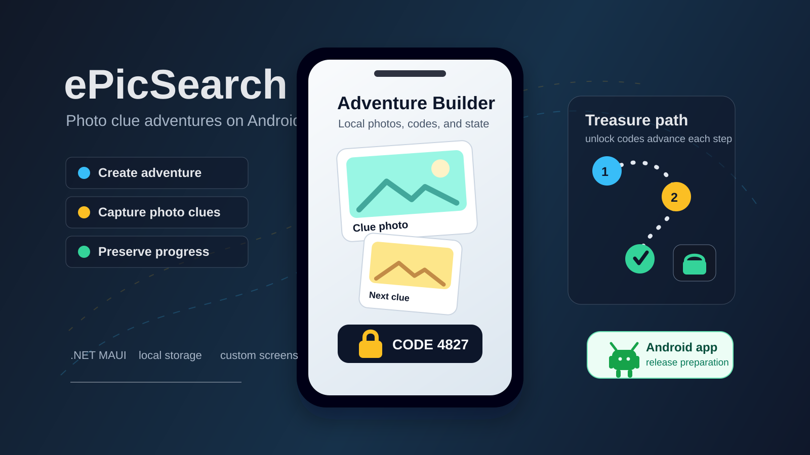

# ePicSearch



**ePicSearch** is a .NET MAUI Android app project for creating and playing photo-based treasure-hunt adventures. It covers the full mobile flow: adventure creation, photo clues, generated unlock codes, local storage, progress/state handling, custom screens, logging, and Android release preparation.

Note: ePicSearch was previously published on Google Play. The current listing is unavailable, so this README does not include a store link.

---

## Core flow

1. Create an adventure.
2. Add photo clues for each step of the route.
3. Add unlock codes that gate the next clue.
4. Save and load the adventure locally.
5. Player advances through clues while progress is preserved.

---

## Technical focus

- Local data management with JSON-based adventure data and file-system photo storage.
- State/progress handling for locked and unlocked clues, adventure completion, last captured photo/code, and resume flows.
- Navigation and custom UI screens built with .NET MAUI Shell, XAML views, custom popups, and reusable controls.
- Logging and diagnostics with Serilog plus a helper for pulling logs from an Android device or emulator.
- Android deployment/release preparation through a `net8.0-android` MAUI app, Android metadata, packaged resources, and release/signing configuration.

---

## Key technologies

- **Framework**: .NET MAUI (Multi-platform App UI)
- **Languages**: C# and XAML
- **Libraries and tools**:
  - `CommunityToolkit.Maui` for enhanced UI components
  - `Newtonsoft.Json` for data serialization
  - `Serilog` for structured logging
  - `Plugin.Maui.Audio` for audio features

---

## Project structure

### General structure

- **Solution**: `ePicSearch.sln`
- **App project**: `ePicSearch.App/ePicSearch.App.csproj`
- **Shared project**: `ePicSearch.Common/ePicSearch.Common.csproj`
- **Tests**: `ePicSearch.Tests/ePicSearch.Tests.csproj`
- **Namespace**: `ePicSearch`

### Key files

- **App.xaml** and **App.xaml.cs**: manage global styles, resources, and app lifecycle behavior.
- **AppShell.xaml** and **AppShell.xaml.cs**: define app navigation and shell structure.
- **MauiProgram.cs**: configures services, logging, and dependencies.
- **DataStorageService**: saves and loads adventure data.
- **PhotoStorageService**: manages photo storage and retrieval.
- **AdventureManager**: coordinates adventure creation, photo state updates, and persistence.

### Folder organization

- **ePicSearch.Common/Entities**: core data models such as `AdventureData`, `PhotoInfo`, `DataStore`, and `Settings`.
- **ePicSearch.Common/Services**: shared logic for adventure management, code generation, data storage, and photo storage.
- **ePicSearch.App/Views**: app screens such as `MainPage`, `CameraPage`, `GamePage`, `MyAdventuresPage`, `NewAdventurePage`, `SettingsPage`, and tutorial/prompt pages.
- **ePicSearch.App/Views/Messages**: custom popups and confirmation/message surfaces.
- **ePicSearch.App/Behaviors** and **Helpers**: custom visual behavior, animation helpers, popup helpers, and UI utilities.
- **ePicSearch.App/Resources**: images, fonts, splash assets, app icon assets, and audio files.

---

## How it works

### Creating adventures

1. Take a photo of the treasure hiding spot. This becomes the first clue.
2. Receive an unlock code, write it down, and hide it in another place as the next clue.
3. Take a photo of the general location where the code was hidden.
4. Receive another code, write it down, and keep building a trail of clues to the treasure.

### Playing adventures

1. Open a saved adventure.
2. The first photo in the trail is available. Find the location from the photo and search for the code.
3. Entering the correct code unlocks the next photo clue.
4. Continue until the treasure is found.

### Logs

- Logs are saved to `logs.txt` in the app's data directory.
- Log output is managed to avoid excessive file size.
- The `Logs/Pull_logs.exe` helper can retrieve the latest log file from an Android emulator/device.

---

## Installation

1. Clone the repository:

   ```bash
   git clone https://github.com/MikeTat1988/epicSearch.git
   ```

2. Open the solution in Visual Studio.
3. Build and run the app on an Android device or emulator.
4. Use `Logs/Pull_logs.exe` if you need to extract the latest app log from the device.

---

## Future improvements

1. Add automatic naming for new adventures.
2. Add an optional hint when a player struggles to find the code paper.
3. Allow sharing adventures with other users.
